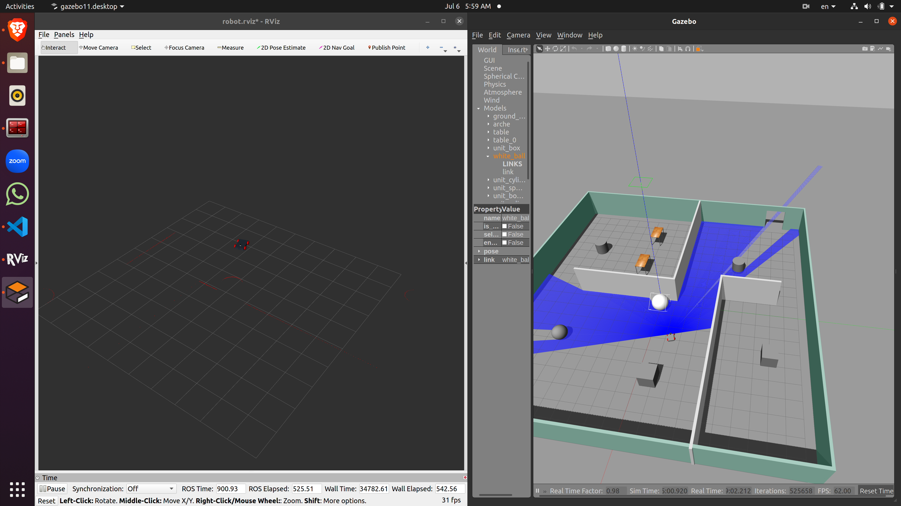

### Directory Structure

    .myrobot_ws/ 
    └── src/
        └── my_robot/
            ├── config/
            │   └── robot.rviz
            ├── images/
            │   └── robot.png
            │   └── chaser.png
            │   └── world.png
            ├── launch/
            │   ├── ball_chaser.launch
            │   ├── gazebo.launch
            │   └── world.launch
            ├── materials/
            │   └── textures/
            │       └── realsense_diffuse.png
            ├── meshes/
            │   ├── hokuyo.dae
            │   └── realsense.dae
            ├── src/
            │   ├── drive_bot.cpp
            │   └── process_images.cpp
            ├── srv/
            │   └── DriveToTarget.srv
            ├── urdf/
            │   ├── colors.xacro
            │   ├── my_robot.gazebo
            │   └── myrobot.urdf.xacro
            ├── worlds/
            │   └── mymap.world
            ├── CMakeLists.txt
            ├── package.xml
            └── README.md

# My Robot

### Robot Model:


This ROS package contains nodes and launch files to control a robot that chases a white ball using image processing. The package includes the following main components:

- Nodes to drive the robot and process images from the robot's camera
- A custom service to send drive commands to the robot
- URDF and Gazebo simulation files

## Prerequisites

- ROS Noetic
- Gazebo
- A ROS workspace

## Installation

1. Create a ROS workspace:
    ```sh
    mkdir myrobot_ws
    cd myrobot_ws
    ```

2. Clone the repository into the `src` directory of your ROS workspace:
    ```sh
    mkdir src
    cd src
    git clone https://github.com/Ahmed-Magdi1/Go-Chase-It.git
    ```

3. Build the package:
    ```sh
    cd myrobot_ws
    catkin_make
    source devel/setup.bash
    ```

## Usage

1. Launch the Gazebo simulation environment and rviz:
    ```sh
    roslaunch my_robot world.launch
    ```

2. Launch the ball chasing nodes:
    ```sh
    roslaunch my_robot ball_chaser.launch
    ```

## Nodes

### drive_bot

This node provides a service to drive the robot by sending linear and angular velocities to the robot's wheels.

- **Subscribed Topics**: None
- **Published Topics**: `/cmd_vel` (geometry_msgs/Twist)
- **Services**: `/ball_chaser/command_robot` (ball_chaser/DriveToTarget)

### process_image

This node processes images from the robot's camera, detects a white ball, and commands the robot to chase the ball by calling the `drive_bot` service.

- **Subscribed Topics**: `/camera/rgb/image_raw` (sensor_msgs/Image)
- **Published Topics**: None
- **Services**: None (calls the `/ball_chaser/command_robot` service)

## Custom Services

### DriveToTarget

This service allows the process_image node to command the drive_bot node to move the robot.

- **Request**:
  - `float64 linear_x`
  - `float64 angular_z`
- **Response**:
  - `string msg_feedback`

## Launch Files

### gazebo.launch

Launches the Gazebo simulation environment with the robot.

### ball_chaser.launch

Launches the `drive_bot` and `process_image` nodes.

### world.launch

Launches the Gazebo simulation environment and rviz with the robot.

## URDF Files

### myrobot.urdf.xacro

Contains the URDF model of the robot.

### my_robot.gazebo

Contains Gazebo-specific settings for the robot.

### colors.xacro

Contains color definitions for the robot.

## world image:


## Ball Chaser:


