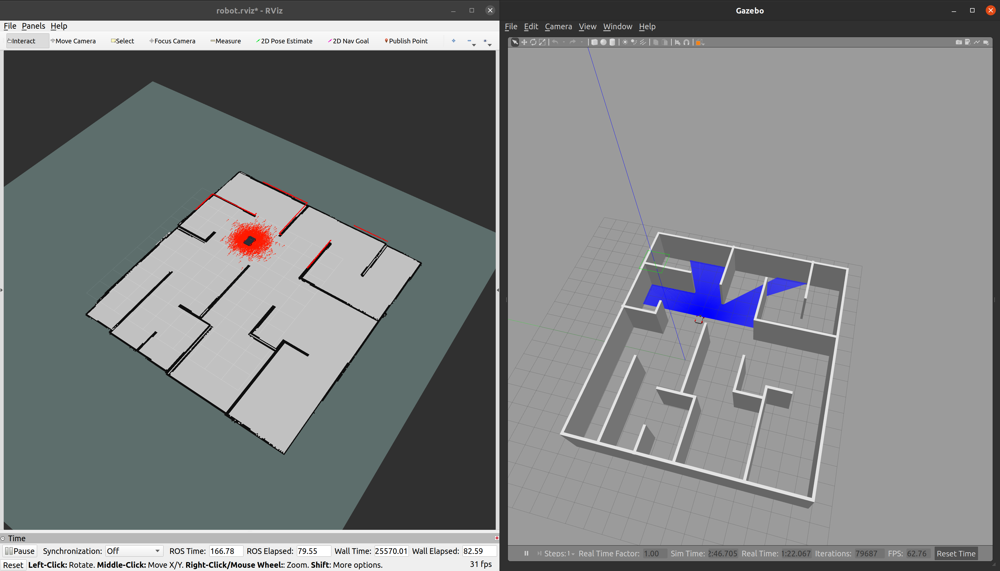
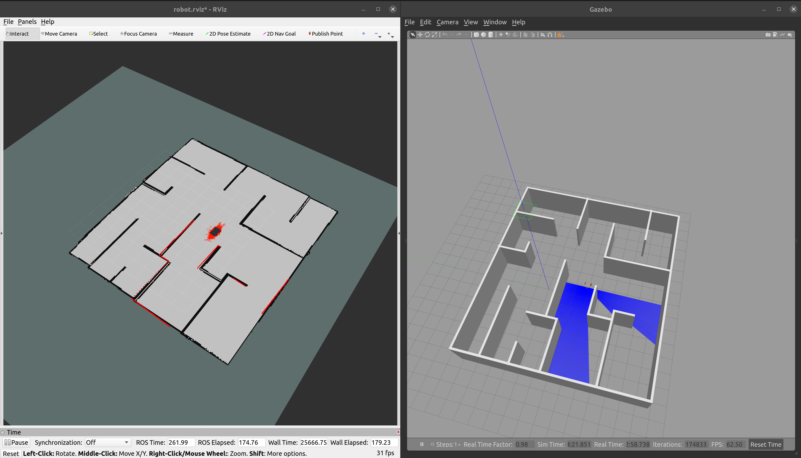
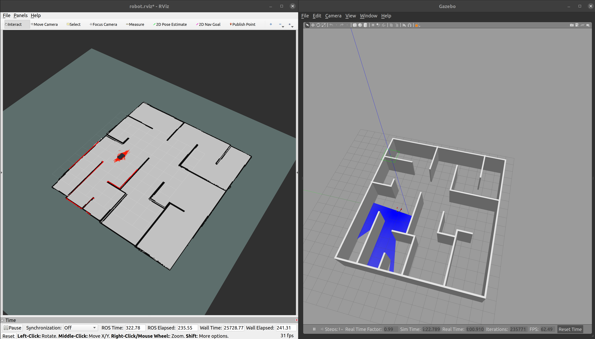

# Bot Workspace

### Directory Structure

    .bot_ws/
    └── src/
        └── my_robot/
            ├── config/
            │   └── robot.rviz
            ├── images/
            │   └── robot.png
            │   └── world.png
            │   └── mcl0.png
            │   └── mcl1.png
            │   └── mcl2.png
            │   └── mcl3.png
            ├── launch/
            │   └── amcl.launch
            │   └── gazebo.launch
            │   └── world.launch
            │   └── create_trajectory.launch
            │   └── EKF.launch
            │   └── robot_pose_ekf.launch
            ├── materials/
            │   └── textures/
            │       └── realsense_diffuse.png
            ├── maps/
            │   └── map.pgm
            │   └── map.yaml
            ├── meshes/
            │   ├── hokuyo.dae
            │   └── realsense.dae
            ├── src/
            ├── urdf/
            │   ├── colors.xacro
            │   ├── my_robot.gazebo
            │   └── myrobot.urdf.xacro
            ├── worlds/
            │   └── maze.world
            ├── CMakeLists.txt
            ├── package.xml
            └── README.md

# My Robot

### Robot Model:


## Prerequisites

- ROS Noetic
- Gazebo
- A ROS workspace

## Installation

1. Create a ROS workspace:
    ```sh
    mkdir myrobot_ws
    cd myrobot_ws
    ```

2. Clone the repository into the `src` directory of your ROS workspace:
    ```sh
    mkdir src
    cd src
    git clone https://github.com/Ahmed-Magdi1/Where-Am-I.git
    ```


3. Build the package:
    ```sh
    cd ..
    catkin_make
    source devel/setup.bash
    ```

## Usage

1. Launch the Gazebo simulation environment and rviz:
    ```sh
    roslaunch my_robot world.launch
    ```

2. Launch the amcl nodes:
    ```sh
    roslaunch my_robot amcl.launch
    ```

## Launch Files

### gazebo.launch

Launches the Gazebo simulation environment with the robot.

### amcl.launch

Launches the MCL nodes.

### world.launch

Launches the Gazebo simulation environment and rviz with the robot.

## URDF Files

### myrobot.urdf.xacro

Contains the URDF model of the robot.

### my_robot.gazebo

Contains Gazebo-specific settings for the robot.

### colors.xacro

Contains color definitions for the robot.

### Before the localization:


### After the localization:



